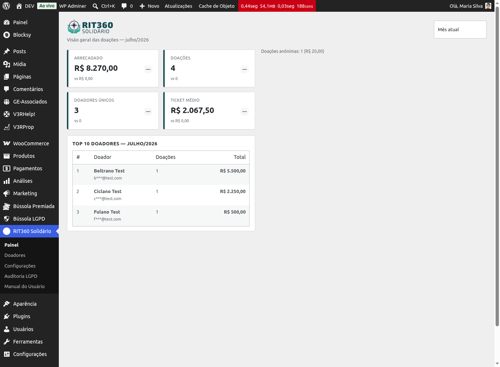
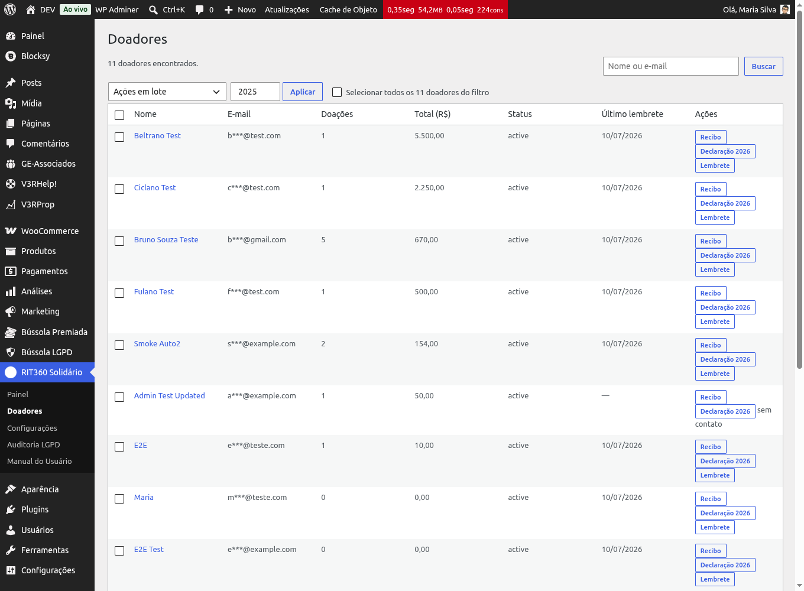
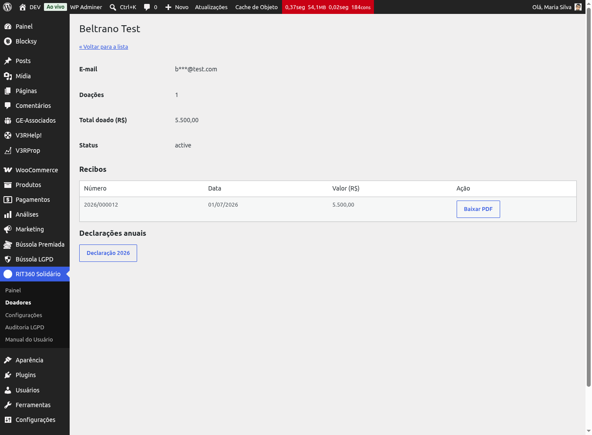
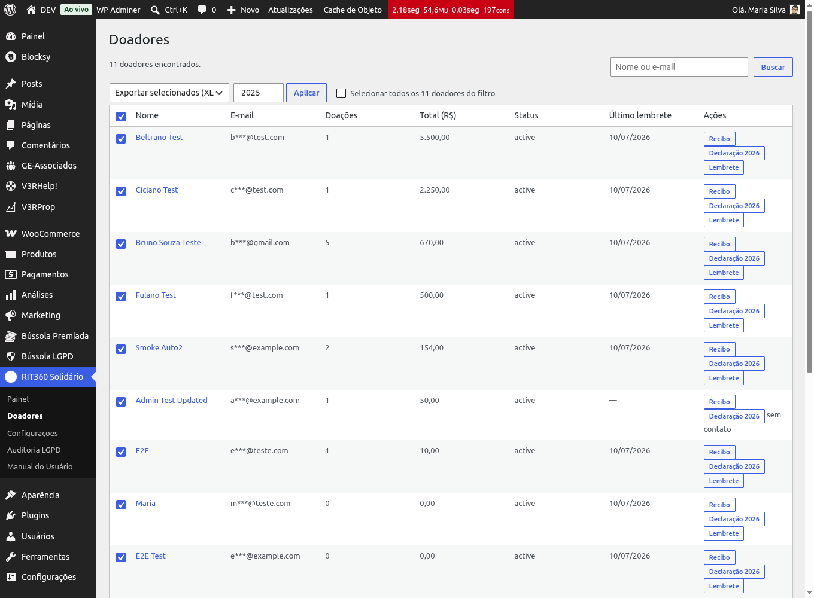

# Acompanhar doações e exportar

No dia a dia você usa o painel para ver quanto foi arrecadado, consultar doações
e doadores, reenviar um recibo e exportar dados para a prestação de contas do
conselho.

## Ver os indicadores no painel

No menu do WordPress, abra **RIT360 Solidário**. O painel mostra os KPIs do
período (com seletor de **mês**, **ano** ou **personalizado**): total arrecadado,
número de doações, doadores únicos, ticket médio, retenção mensal e os principais
doadores.

## Consultar e filtrar doações

1. Abra **RIT360 Solidário → Doações**.
2. Use os filtros (período, status, valor, doador, forma de pagamento, produto)
   para encontrar o que procura.
3. Clique em uma linha para **ver o detalhe** da doação.

## Atender um pedido de segunda via

Quando um doador pede a segunda via do recibo:

1. Abra **RIT360 Solidário → Doadores** e busque pelo e-mail.
2. Abra a **ficha do doador** — você vê todas as doações, consentimentos e
   comunicações.
3. Clique em **Reenviar recibo** (ou **Reenviar magic link**, se ele quiser
   acessar o próprio painel).

{: .note }
> Também dá para reenviar a **declaração anual** e, a pedido do doador,
> **anonimizar** os dados dele (veja a futura página do LGPD Center).

## Exportar para a prestação de contas

Na lista de **Doações** ou de **Doadores**, use **Exportar** para gerar
**PDF**, **CSV** ou **XLSX** respeitando os filtros aplicados. O XLSX preserva
CPF, CEP e telefone como texto (não vira número), pronto para anexar à ata do
conselho.

## Dicas

- Todo mês você recebe um **e-mail com o resumo** do mês anterior — um bom gatilho
  para exportar e enviar ao conselho.
- Precisa das declarações anuais de todos os doadores? Use o disparo em **lote**
  na área de Relatórios (declaração anual em zip protegido).
