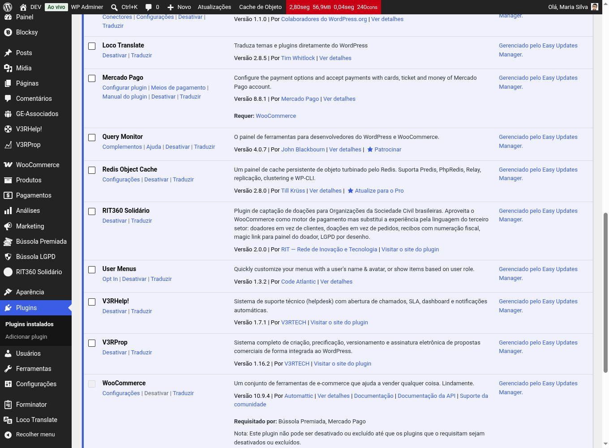
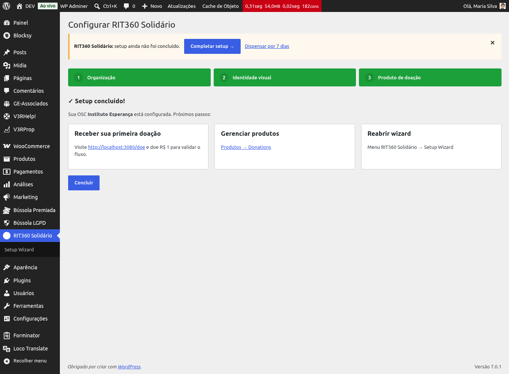
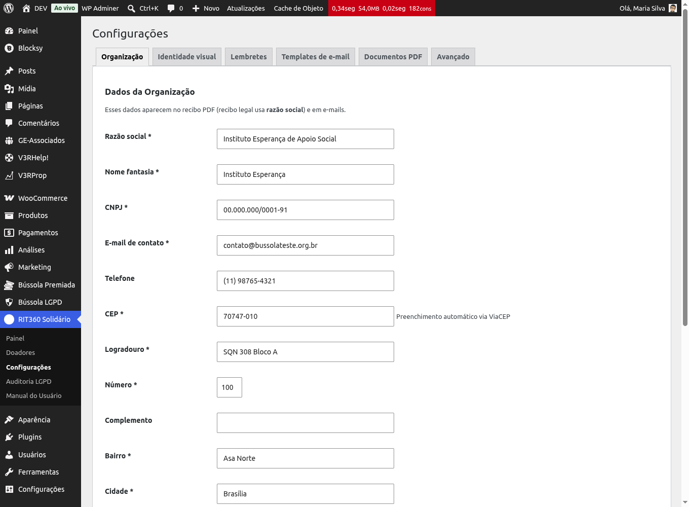
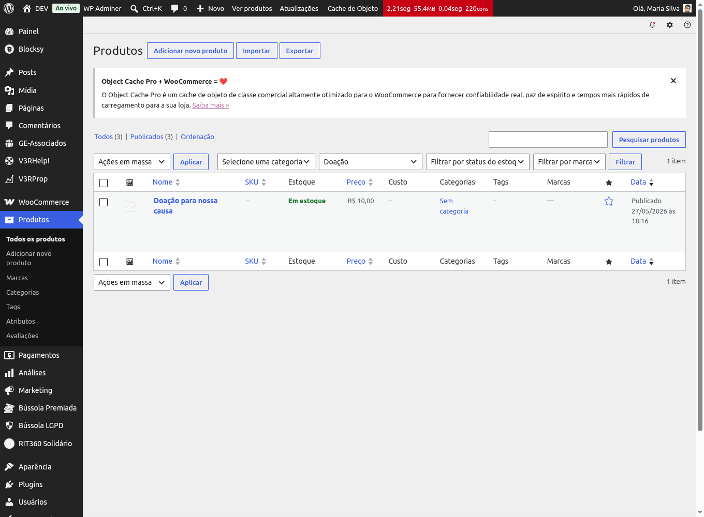

# Primeiros passos

Nesta página você instala o RIT360 Solidário, ativa o plugin e conclui o
**Setup Wizard** — o assistente que prepara tudo para você receber a primeira
doação: dados da OSC, identidade visual, o primeiro produto de doação e a página
pública de doação.

Você precisa de um WordPress com o **WooCommerce** instalado e ativo (é o motor
de pagamento). O RIT360 Solidário cuida do resto.

## Passo a passo

### 1. Instalar e ativar o plugin

Você recebe o plugin como um arquivo `.zip` (por exemplo,
`rit360-solidario-2.0.0.zip`).

1. No painel do WordPress, abra **Plugins → Adicionar novo → Enviar plugin**.
2. Selecione o arquivo `.zip` e clique em **Instalar agora**.
3. Clique em **Ativar**.

{: .note }
> Se o WooCommerce ainda não estiver ativo, o WordPress avisa. Instale e ative o
> WooCommerce primeiro.

### 2. Abrir o Setup Wizard

Logo após ativar, o plugin oferece o **Setup Wizard**. Você também pode abri-lo
depois em **RIT360 Solidário → Configurações**.

### 3. Preencher os dados da OSC e a identidade visual

O assistente pede, em etapas:

1. **Dados da OSC** — nome, CNPJ, endereço e contato. Aparecem no recibo e nos
   e-mails.
2. **Identidade visual** — logo e cores da organização. O logo entra no recibo e
   na declaração anual.

{: .note }
> O logo pode ser PNG ou JPG. Se usar PNG com fundo transparente, o recibo o
> compõe sobre fundo branco automaticamente.

### 4. Criar o primeiro produto de doação e a página `/doe`

Na última etapa, o wizard cria para você:

- um **produto de doação** com valores sugeridos (você ajusta depois);
- a **página pública de doação** (por padrão em `/doe`), pronta para divulgar.

Se nenhum meio de pagamento estiver configurado, o wizard habilita o **Pagamento
na entrega (COD)** apenas para você testar o fluxo de ponta a ponta.

## Pronto! E agora?

- Divulgue o link da sua página de doação (`/doe`).
- Faça uma doação de teste para ver o fluxo do doador — veja
  [Fazer uma doação](../doador/fazer-uma-doacao).
- Configure meios de pagamento reais (PIX, cartão, boleto) no WooCommerce.
- Acompanhe as doações no painel — veja
  [Acompanhar doações e exportar](./acompanhar-e-exportar).

## Dicas

- Você pode **reabrir o Setup Wizard** a qualquer momento em
  **RIT360 Solidário → Configurações**.
- As cores e o logo continuam editáveis depois, na aba **Identidade visual**.
