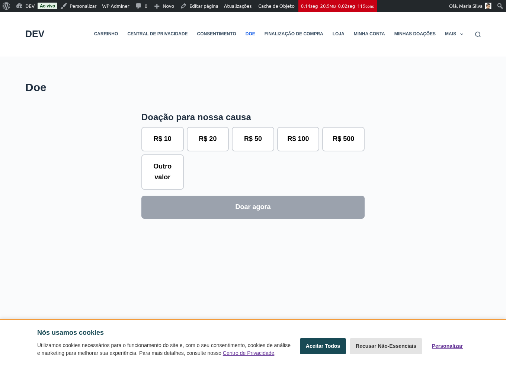
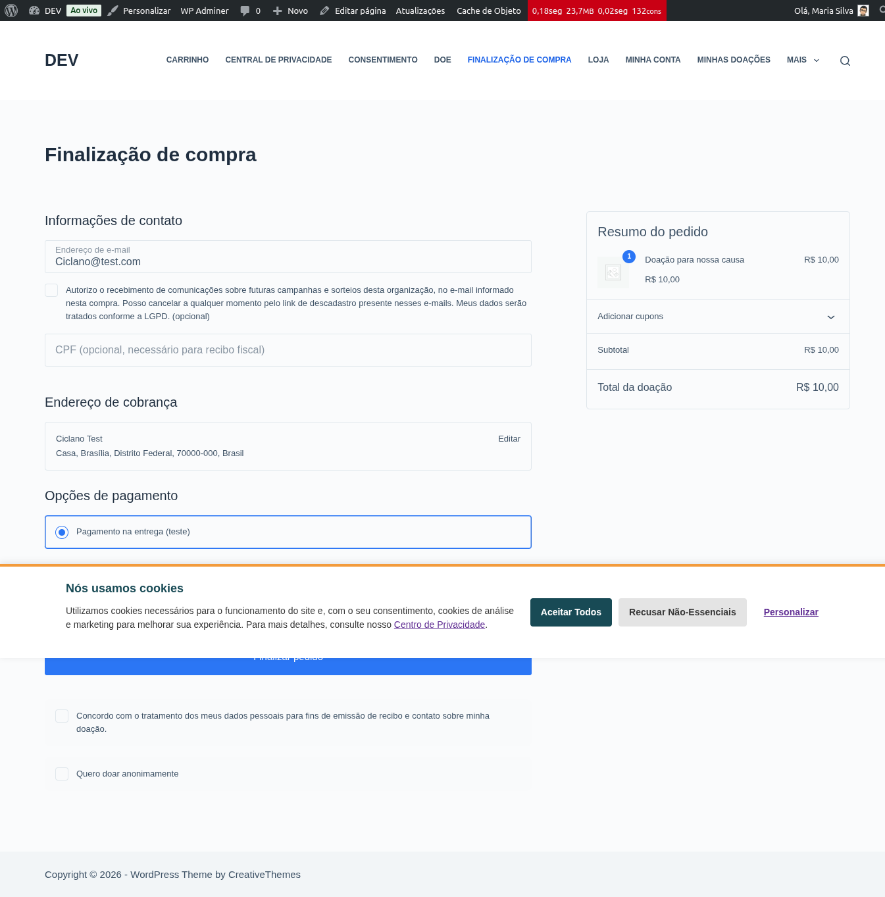
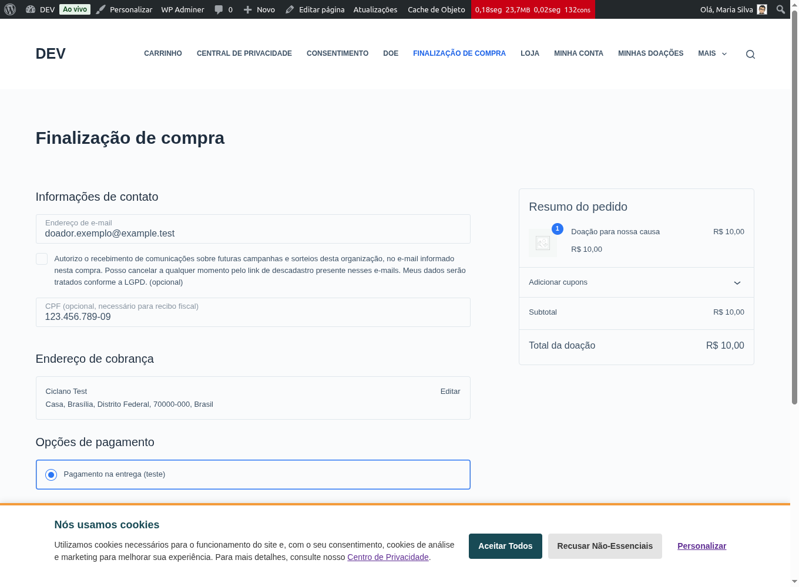
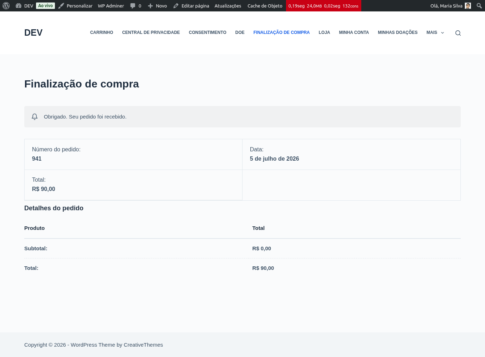

# Fazer uma doação

Doar leva menos de um minuto e **não exige cadastro**. Você escolhe o valor,
informa seus dados essenciais e paga pelo meio que preferir (PIX, cartão ou
boleto, conforme a organização tiver habilitado).

## Passo a passo

### 1. Escolher o valor

Na página de doação da organização, escolha um dos **valores sugeridos** ou digite
um **valor livre**. Se a organização permitir, você também pode deixar uma
**mensagem**.

### 2. Preencher e concordar com o uso dos dados

No checkout, informe **nome** e **e-mail** (é para onde vão o recibo e o acesso
ao seu painel). O **CPF** é opcional — informe se quiser recibo com validade
fiscal.

Marque a caixa de **consentimento LGPD** para concluir a doação. Sem ela, o botão
de finalizar fica bloqueado.

{: .note }
> O botão de finalizar mostra **“Doar agora”** e os totais aparecem como
> **“Valor da doação”** — você está doando, não comprando.

### 3. (Opcional) Doar anonimamente

Se preferir não aparecer no mural de doadores nem receber recibo nominal, marque
**“Quero doar anonimamente”**. O campo aparece quando o carrinho é só de doação.

{: .warning }
> Doações anônimas **não geram recibo** e seus dados de identificação são
> removidos após a confirmação. Se você precisa do recibo fiscal, **não** marque
> esta opção.

### 4. Pagar e receber a confirmação

Escolha o meio de pagamento e conclua. Ao final, você vê a página de agradecimento
e recebe um **e-mail de reconhecimento** da organização.

{: .note }
> No **PIX/boleto**, o pedido fica *aguardando pagamento* até você pagar. Você
> recebe o e-mail com o QR Code/linha digitável **e** um e-mail de reconhecimento
> da OSC. O **recibo** é enviado quando o pagamento é confirmado.

## E depois?

- Para acompanhar suas doações e baixar recibos, veja
  [Recibo e meu painel](./recibo-e-painel).
