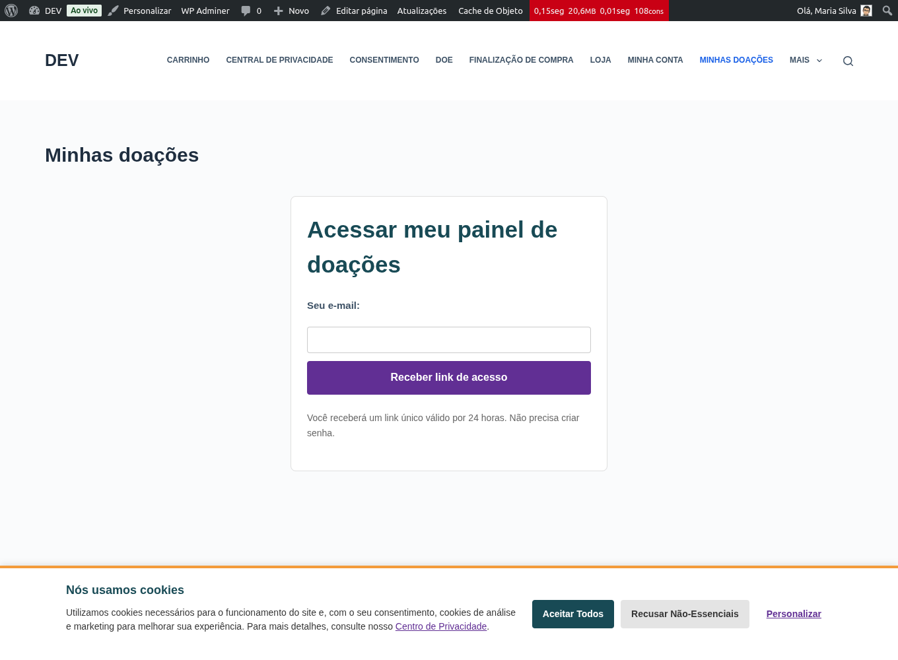
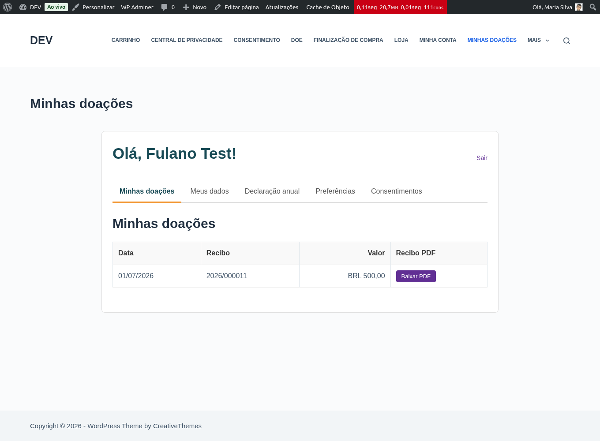
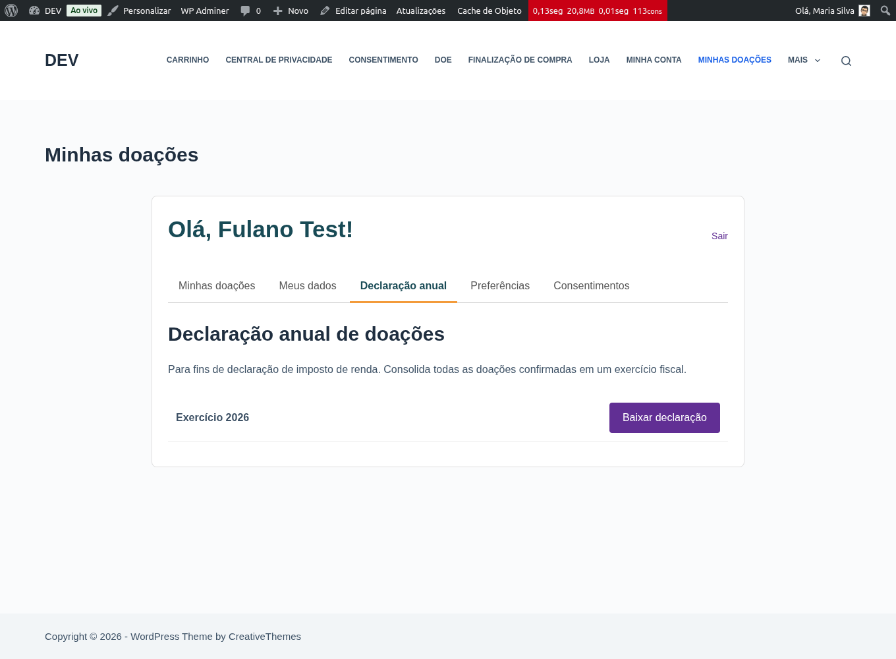

# Recibo e meu painel

Você acessa seu histórico de doações, recibos e a declaração anual por um
**painel próprio** — sem senha e sem criar conta. O acesso é por um **link
enviado ao seu e-mail** (o *magic link*).

## Entrar no meu painel (magic link)

1. Abra a página **Minhas doações** da organização (por exemplo, `/minhas-doacoes`).
2. Digite o **e-mail** que você usou ao doar e clique em **Receber link de acesso**.
3. Abra o e-mail que chegar e clique no **link** — ele leva direto ao seu painel.

{: .note }
> Por segurança, a mensagem na tela é sempre a mesma, exista ou não cadastro para
> aquele e-mail. O link **expira** e é de **uso único** — se precisar, peça outro.

## Baixar um recibo (ou segunda via)

No painel, você vê a lista das suas doações confirmadas. Em cada uma, clique em
**Baixar recibo** para obter o PDF, com numeração fiscal e os dados da
organização.

## Baixar a declaração anual

Para o Imposto de Renda, você pode gerar a **declaração anual**, que consolida
todas as suas doações confirmadas no ano.

1. No painel, escolha o **ano**.
2. Clique em **Baixar declaração anual**.

## Repetir uma doação

Se você optou por **lembretes**, todo mês (ou na periodicidade que escolher)
recebe um e-mail com o botão **“Repetir doação anterior”**, que já abre o checkout
pré-preenchido. Você pode pular meses sem cancelar nada.

## Gerenciar lembretes e privacidade

- Para **parar de receber lembretes**, clique em **“Não quero mais receber
  lembretes”** no rodapé do e-mail — vale em um clique, sem login.
- Para escolher **aparecer ou não no mural** de doadores, ajuste a preferência no
  seu painel.
